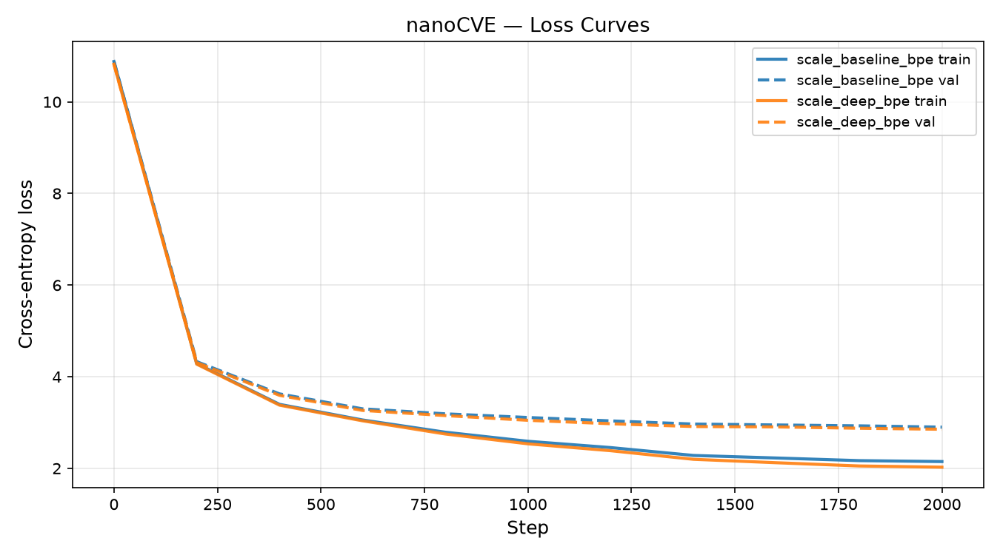

# nanoCVE
**A small GPT pretrained from scratch on CVE descriptions.**

nanoCVE is a from-scratch PyTorch implementation of a GPT-style decoder-only transformer, pretrained on NVD CVE descriptions. The goal is not a production-ready security tool, but a clean, readable demonstration of pretraining mechanics: the data pipeline, tokenization choices, hand-written training loop, and the effect of scaling.

The name nods to [nanoGPT](https://github.com/karpathy/nanoGPT) — both are minimal, educational implementations of the same architecture.

---

## Table of contents
1. [Quickstart](#quickstart)
2. [Project structure](#project-structure)
3. [Data](#data)
4. [Model architecture](#model-architecture)
5. [Tokenization comparison](#tokenization-comparison)
6. [Training](#training)
7. [Scaling experiment](#scaling-experiment)
8. [Sample generations](#sample-generations)
9. [Loss curves](#loss-curves)
10. [Limitations & next steps](#limitations--next-steps)

---

## Quickstart

```bash
# 1. Install dependencies
pip install -r requirements.txt

# 2. Download + process CVE corpus (~10k CVEs for a fast run; remove --limit for full set)
python data/prepare.py --limit 10000

# 3. Train (default config, BPE tokenizer, GPU/MPS/CPU auto-detected)
python train.py --config configs/default.py --tokenizer bpe --batch_size 16

# 4. Generate text
python sample.py --run_name default_bpe --prompt "A vulnerability in"

# 5. Run scaling experiment (6L vs 12L)
make scale
```

Or use the Makefile shortcuts:
```bash
make prepare-small   # 10k CVEs
make train-bpe       # default config
make sample
make scale
make plot
```

---

## Project structure

```
nanoCVE/
├── data/
│   ├── prepare.py          # download NVD API → tokenized corpus
│   └── cache/              # processed corpus (gitignored)
├── tokenizer/
│   ├── char_tokenizer.py   # character-level (vocab ~97)
│   └── bpe_tokenizer.py    # BPE via tiktoken gpt2 (vocab 50,257)
├── configs/
│   ├── small.py            # 4L-4H-256E-128ctx  (CPU-friendly)
│   ├── default.py          # 6L-6H-384E-256ctx  ~30M params
│   └── scale_depth.py      # 12L-6H-384E-256ctx ~41M params
├── model.py                # GPTConfig + full model (heavily commented)
├── train.py                # hand-written training loop
├── sample.py               # generate text from a checkpoint
├── plot_loss.py            # regenerate loss curves from CSV
├── runs/                   # per-run checkpoints + CSV logs (gitignored)
├── requirements.txt
└── Makefile
```

---

## Data

**Source:** NVD API 2.0 (`services.nvd.nist.gov/rest/json/cves/2.0`), which serves ~360k public CVE entries. We extract only the English natural-language `description` field — clean, defensive, factual text about software vulnerabilities.

Example description:
> *"Buffer overflow in the FTP service in Windows NT 4.0 allows remote attackers to cause a denial of service via a long hostname or user parameters."*

**Pipeline (`data/prepare.py`):**
1. Paginate through NVD API 2.0 in batches of 2000, respecting rate limits (5 req/30s unauthenticated; set `NVD_API_KEY` env var for 50 req/30s).
2. Extract the English `description` field, deduplicate by CVE-ID.
3. Drop `** RESERVED **` / `** REJECT **` placeholders and entries < 30 characters.
4. Shuffle deterministically (seed=42) and split 90/10 by document — not by token — to prevent description fragments leaking across splits.
5. Tokenize with both char and BPE tokenizers and serialize to numpy memmaps for fast random-access batching.

**Corpus statistics (10k CVE run used for these experiments):**

| Metric | Value |
|---|---|
| CVE descriptions | 9,992 |
| Total characters | 1,954,094 |
| Char vocab size | 97 |
| BPE vocab size | 50,257 |
| Train tokens (char) | 1,763,220 |
| Train tokens (BPE) | 415,214 |
| Char/BPE ratio | 4.25× |

Results are cached in `data/cache/` — re-running `prepare.py` reads from cache unless `--force` is passed.

---

## Model architecture

A standard decoder-only transformer, implemented in `model.py` with detailed comments on every design decision.

```
Token embedding (vocab_size → n_embd)
  +
Positional embedding (block_size → n_embd)
  ↓
Dropout
  ↓
N × TransformerBlock
  ├─ LayerNorm  (pre-LN: normalize before, not after)
  ├─ CausalSelfAttention  (n_head heads, causal mask via torch.tril)
  ├─ residual add
  ├─ LayerNorm
  ├─ MLP  (n_embd → 4×n_embd → n_embd, GELU)
  └─ residual add
  ↓
Final LayerNorm
  ↓
Linear head → logits (weight-tied to token embedding)
```

**Key design choices:**
- **Pre-LN:** normalize inputs *before* each sub-layer rather than after. More stable gradient flow than the original post-LN, especially without extensive LR tuning.
- **Weight tying:** the output projection matrix shares weights with the token embedding matrix. This halves the parameter count for the largest tensor (~19M params at BPE scale) and forces the model to use one consistent representation space for both input and output.
- **Causal mask:** `torch.tril`-based mask ensures position `t` only attends to `0..t`. This is what makes the model autoregressive.
- **GELU activation:** smoother than ReLU near zero, standard in GPT-2 and beyond.

**Default config:**

| Hyperparameter | Value |
|---|---|
| `n_layer` | 6 |
| `n_head` | 6 |
| `n_embd` | 384 |
| `block_size` | 256 |
| `dropout` | 0.1 |
| Parameters (BPE, vocab=50,257) | ~30M |
| Parameters (char, vocab=97) | ~11M |

> **Why the param gap?** The token embedding matrix is `vocab_size × n_embd`. At BPE's 50,257-token vocab that's ~19M parameters on its own — nearly two thirds of total. Weight tying halves this cost (lm_head reuses the matrix), but it still dominates.

---

## Tokenization comparison

Two tokenizers are implemented and configurable via `--tokenizer char` or `--tokenizer bpe`.

### Character-level tokenizer (`tokenizer/char_tokenizer.py`)

- **Vocab size:** 97 (every unique character seen in the corpus)
- **How it works:** each character maps to a unique integer; the model must learn spelling, words, and semantics entirely from scratch.
- **Sequence length:** 4.25× longer than BPE for the same text. A 200-character description = 200 char tokens vs ~47 BPE tokens.
- **Pros:** trivially simple, no dependencies, vocabulary is fully corpus-specific.
- **Cons:** longer sequences drive up attention compute quadratically. The model spends capacity on spelling before it can learn meaning.

### BPE tokenizer (`tokenizer/bpe_tokenizer.py`)

- **Vocab size:** 50,257 (tiktoken's `gpt2` encoding — no training required)
- **How it works:** common subword sequences are pre-merged into single tokens. "overflow", "vulnerability", "arbitrary" are typically single tokens.
- **Sequence length:** 4.25× shorter than char, so the model sees more semantic content per context window.
- **Pros:** security terminology tokenizes cleanly, shorter sequences, faster semantic learning.
- **Cons:** 50k vocab is much larger than needed for this corpus — the embedding table holds ~19M barely-used parameters.

### Comparison table

| Property | Char | BPE (gpt2) |
|---|---|---|
| Vocab size | 97 | 50,257 |
| Avg tokens per description | ~196 | ~46 |
| Model params (6L-6H-384E) | ~11M | ~30M |
| Val loss at 2000 steps | — | **2.90** |
| Train/val gap at 2000 steps | — | 0.75 |
| Sample quality | Learns spelling then words; coherent but slow to converge | Immediately works at word/phrase level; generates plausible CVE structure |

**Which to use?** BPE is the practical default — shorter sequences let the model fit more semantic content into the context window, and the pre-built vocabulary gives an immediate head start on security terminology. Char-level is the better teaching tool: watching the model learn to spell "buffer overflow" character by character makes the pretraining objective viscerally clear.

---

## Training

The training loop in `train.py` is written entirely by hand — no Trainer, Lightning, or Accelerate.

**Optimizer:** AdamW with `β=(0.9, 0.95)`. Weight decay (0.1) is applied only to weight matrices; biases and LayerNorm parameters are excluded because they don't benefit from L2 regularization.

**LR schedule:** linear warmup for 200 steps, then cosine decay from `3e-4` to `3e-5`. Cosine decay gives the model a smooth approach to convergence rather than a hard LR step.

**Gradient clipping:** `max_norm=1.0`. Prevents gradient spikes — common early in training — from derailing the optimizer state.

**Batching:** random windows of `block_size` tokens sampled from a numpy memmap. No shuffle buffer needed since uniform random sampling covers the whole training array.

**Checkpointing:** the model with the best validation loss is saved to `runs/<run_name>/ckpt_best.pt`. Checkpoints include model state, optimizer state, config dict, and tokenizer name for full reproducibility.

**Logging:** train and val loss are written to `runs/<run_name>/losses.csv` at every eval interval. A `loss_curve.png` is generated automatically at the end of training.

---

## Scaling experiment

To observe the effect of depth, we train two configs differing on **one axis only**: `n_layer`.

| Config | n_layer | n_head | n_embd | block_size | Params (BPE) | Final val loss |
|---|---|---|---|---|---|---|
| `default` (baseline) | 6 | 6 | 384 | 256 | ~30M | **2.900** |
| `scale_depth` | **12** | 6 | 384 | 256 | ~41M | **2.853** |

```bash
make scale
python plot_loss.py --run_name scale_baseline_bpe scale_deep_bpe --out loss_comparison.png
```



**Observations:**

- **Val loss:** the 12-layer model reaches a lower final val loss (2.853 vs 2.900) — a consistent ~0.05 improvement that holds across all eval checkpoints from step 200 onward.
- **Training speed:** 12L takes roughly **1.8× more time per step** than 6L (each additional layer adds a full forward+backward pass through attention + MLP). At batch_size=16 on Apple Silicon MPS, 6L ran at ~0.87s/step vs ~1.53s/step for 12L.
- **Overfitting gap** (train − val loss) at step 2000: 6L gap = 0.75, 12L gap = 0.83. The deeper model has slightly more capacity to memorize the small training set.
- **Interpretation:** with only ~415k BPE tokens in the training set, 6 layers already has sufficient capacity to model the distribution well. Doubling depth helps at the margin — the extra layers capture more compositional structure in vulnerability descriptions — but the gains are modest compared to the compute cost. The classic bias-variance tradeoff: more depth → lower bias, slightly higher variance, and higher cost per step. On a larger corpus the advantage of depth would compound.

---

## Sample generations

Generated from the **6L baseline** checkpoint (val loss 2.90, step 2000), `temperature=0.9, top_k=50`.

**Prompt: "A vulnerability in"**

> A vulnerability in BSD-based operating systems allows local users to gain additional privileges.
>
> Oracle 9i with the NetAOLVOS 9i Application Server 1.2.1.0.2 and earlier, creates predictable names and stores a cleartext in the registry by the PATH environment variable, which allows local users to gain privileges.
>
> Vulnerability in AIX 4.3.3.3 and 5.1.3 allows local users to gain privileges via unknown attack vectors.
>
> Cisco IOS R5.1 through 12.2 allows remote attackers to cause a denial

---

Generated from the **12L deep** checkpoint (val loss 2.85, step 2000).

**Prompt: "Buffer overflow in"**

> Buffer overflow in the FTP service in Windows NT 4.0 allows remote attackers to cause a denial of service via a long (1) hostname or (2) user-of-b parameters to xserver.
>
> The Web Administration in Microsoft Terminal Server 2000 and 2004 stores user names and passwords in the registry administrator's registry, which is uploaded into the registry, which allows local users to overwrite files.
>
> Directory traversal vulnerability in XFree86 4.1 and 5.1 allows attackers to read arbitrary files via a .. (dot dot) attack and an archive.

**Prompt: "SQL injection in"**

> SQL injection in the calendar module in Php-Nuke allows remote attackers to inject arbitrary web script or HTML via the Searchname parameter.
>
> Denial of service in Cisco CBMS, in the IP protocol of HP-UX 11.00 through 11.20 allows remote attackers to cause a denial of service by sending a malformed packet to port 1434.
>
> Buffer overflow in the LDAP service (ns-based telnetd) for Cisco routers allows an attacker to execute arbitrary commands via a long user name.

The model has clearly internalized CVE description structure: product + version range, attack vector, impact clause, and the "allows remote/local attackers to..." formula. The hallucinated version numbers and product combinations are a natural consequence of the model recombining patterns from the training corpus.

---

## Loss curves

Loss curves are saved automatically to `runs/<run_name>/loss_curve.png` after each training run.

**Baseline 6L — train vs val:**


**Scaling comparison — 6L vs 12L:**


---

## Limitations & next steps

**What this project demonstrates:**
- A complete GPT pretraining pipeline written from scratch, with every component documented.
- Configurable char-level and BPE tokenization with a real tradeoff analysis.
- A reproducible scaling experiment showing the effect of depth on val loss, training speed, and overfitting.

**What it is not:**
- A practical security tool. The model has no semantic understanding of CVEs — it learns the statistical patterns of vulnerability description prose.
- Competitive with GPT-2 small. At ~30M parameters and ~415k training tokens (10k CVEs), the model is severely data-starved by Chinchilla standards — the compute-optimal token count for 30M params is ~600M tokens. The generations are structurally correct but factually hallucinated.

**Natural next steps:**
1. **More data:** use the full ~360k CVE corpus (activate an NVD API key for fast download) or add GitHub Security Advisories (GHSA).
2. **Longer training:** the Chinchilla scaling laws suggest ~600M tokens for a 30M-param model to be compute-optimal — we trained on 415k.
3. **Flash Attention:** swap in `F.scaled_dot_product_attention` (PyTorch 2.0+) for a free ~2× attention speedup.
4. **Mixed precision:** `torch.autocast("cuda", dtype=torch.bfloat16)` halves memory and speeds training ~30% on CUDA.
5. **Fine-tuning experiment:** take the pretrained base and fine-tune on CVSS score prediction — a natural next step for a security-focused portfolio.
